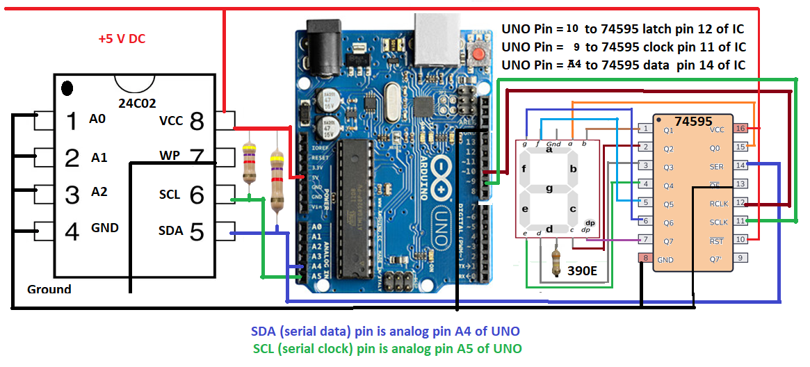

# I2C_Spy_Shift

An efficient hardware-assisted I2C sniffing tool. This project connects the Serial Data line (SDA) of a 24C02 EEPROM directly to the Data Input of a 74HC595 shift register. The Arduino Uno acts as the intelligent controller, monitoring the I2C clock and pulsing the shift register clocks to achieve direct serial-to-parallel conversion without data buffering delays.

## Hardware Wiring Diagram

| Arduino Uno Pin | 24C02 EEPROM Pin | 74HC595 Shift Register Pin | Function |
| :--- | :--- | :--- | :--- |
| **A4** | Pin 5 (SDA) | Pin 14 (DS) | Shared I2C Data / Shift Data Input |
| **A5** | Pin 6 (SCL) | - | I2C Clock Line (Monitored by Uno) |
| **Pin 9** | - | Pin 11 (SH_CP) | Shift Register Clock (Driven by Uno) |
| **Pin 10** | - | Pin 12 (ST_CP) | Latch Clock (Driven by Uno) |
| **GND** | Pin 4 (GND) | Pin 8 (GND) / Pin 13 (OE) | Common Ground |
| **5V** | Pin 8 (VCC) | Pin 16 (VCC) / Pin 10 (MR) | Power Supply |

## How It Works
1. **Direct Data Feed:** The I2C data stream traveling between the Master and the 24C02 EEPROM passes through Pin 14 of the 74HC595 simultaneously.
2. **Clock Syncing:** The Arduino Uno monitors the I2C SCL line (Pin A5). On every relevant clock pulse, the Uno toggles Pin 9 (SH_CP) to instantly shift that bit into the 74HC595.
3. **Parallel Latch:** Once an 8-bit byte transaction is complete, the Uno toggles Pin 10 (ST_CP) to output the captured byte across the shift register's parallel output pins (Q0–Q7).

## Detailed Technical Explanation

Standard I2C sniffing usually requires an expensive logic analyzer or a microcontroller that buffers data in software before outputting it. This project uses a unique, ultra-fast **hardware-passthrough approach**.

### The Core Concept: Direct Hardware Ingestion
Instead of routing the I2C Serial Data (SDA) line strictly into the Arduino Uno and making the processor copy that data to another pin, the **SDA line (24C02 Pin 5) is wired directly into the Data Serial input (DS / Pin 14) of the 74HC595 shift register**. 

Because they share the same physical wire, the 74HC595 "sees" every single bit that travels across the I2C bus at the exact same time the EEPROM does.

### The Role of the Arduino Uno
The Arduino Uno does not process or pass the data bits. Instead, it acts as a **smart clock synchronizer and filter**. 

* **Bit Shifting (The Clock):** The Arduino monitors the I2C Serial Clock (SCL) on pin A5. Every time the SCL line transitions, the Arduino immediately pulses **Pin 9 (SH_CP)**. This hardware pulse forces the 74HC595 to lock in whatever state (HIGH or LOW) is currently sitting on the SDA line, shifting it into internal memory.
* **Byte Latching (The Storage):** The Arduino counts the incoming SCL clock cycles. Once a full 8-bit byte payload has been successfully shifted into the register, the Arduino pulses **Pin 10 (ST_CP)**. This instantly updates the parallel output pins (Q0–Q7) with the newly captured byte.
* **Bus Isolation:** Because the 74HC595 input pins are high-impedance, this physical tapping does not overload or corrupt the main I2C communication between the Master device and the 24C02 EEPROM.

### Why this method is superior:
* **Zero Software Latency:** The data is already physically present inside the shift register's input stage before the Arduino even processes a loop, preventing dropped bits.
* **Processor Efficiency:** The Uno only handles basic timing and counting rather than heavy memory management.
* ## 7-Segment Display Output Decoding

To visually verify the parallel output data coming out of the 74HC595 shift register, a standard common-anode or common-cathode 7-segment display is connected to pins Q0–Q7.

### Hardware Mapping
The parallel outputs of the shift register map to the individual LED segments (a through g) of the display as follows:
* **Q0** -> Segment **a**
* **Q1** -> Segment **b**
* **Q2** -> Segment **c**
* **Q3** -> Segment **d**
* **Q4** -> Segment **e**
* **Q5** -> Segment **f**
* **Q6** -> Segment **g**
* **Q7** -> Decimal Point (**dp**)

*Note: A 390Ω current-limiting resistor is placed on the common pin of the display to protect the hardware from overcurrent.*

### Software Behavior
Inside the provided Arduino sketch, the timing logic tracks the exact 8 SCL transitions representing a data byte on the I2C bus. Once a full valid frame is captured, the Uno triggers the Latch pin (Pin 10). This instantly updates the shift register outputs, lighting up the corresponding segments on the display to show the live data byte passing through the bus.

